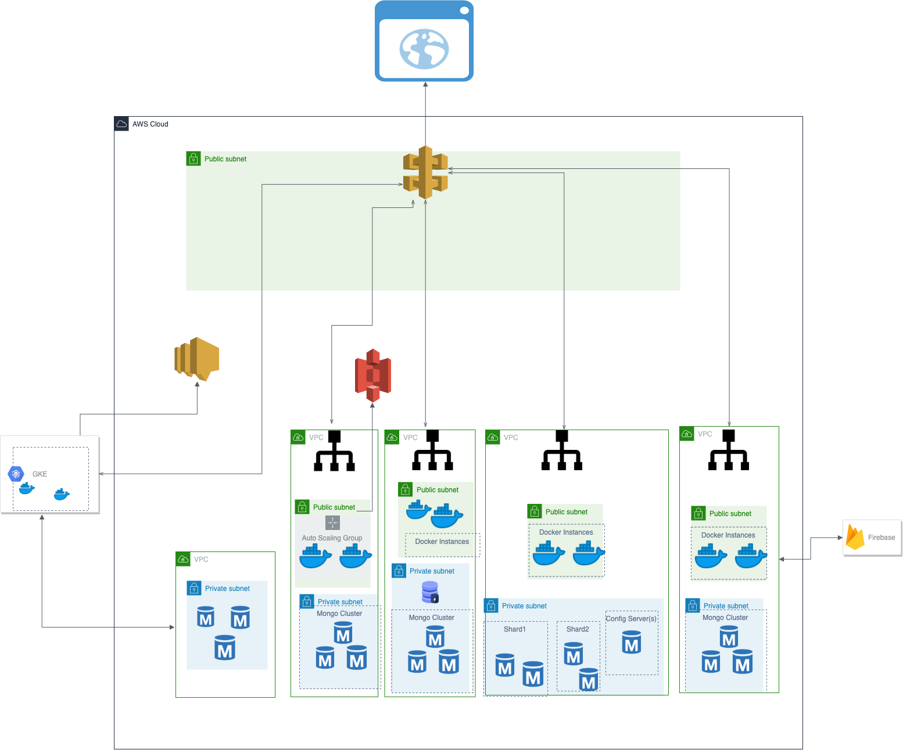

# fa19-281-marss : Air BNB Booking

## Team - MARSS

## Team Members:
         
    1. Jaya Sindhu Manda
    2. Rohan
    3. Apeksha
    4. Mrinalini
    5. Siddesh

## Summary:
1. Microservices : We have used Golang for the development of all the services like Login, Profile creation, Property Publishing, Property searching and Booking.

2. MongoDB: For storing the users data and consistent fast retrieval, We chose mongo db. Since mongo db is a non-SQL database, it is very convenient to store the data without strict schema definition.

3. **JWT**: For maintaining sessions, we are using JWTs over the traditional cookie-based sessions. JWTs are as much secure and much more scalable since the server overhead is very less. The JWT signature and the client secret ensures that there was no tampering with the JWT.

4. **Redis**: For storing the JWT secret, We are using Redis as the in-memory caching layer. Since this will be invoked on every API call, there was a need for in-memory storage which is highly available. The Redis also provided in-built TTL which ensured that a session becomes invalid after 60 minutes.

5. Docker: Deployed few of the services in AWS instances. This made it even more scalable.

6. **MongoDB Sharding**: As the size of the data increase, data partitioning becomes very important. For setting this, we created two sharded cluster, two config servers, and one mongos for each service.

7. **GKE(Kubernetis)**:

8. **SNS**:

9. **S3**:

10. **FireBase**:

## Architecture Diagram:

